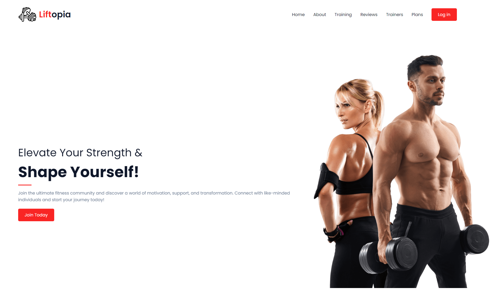

<h1>Liftopia</h1>

  Liftopia is a web application developed as part of the "Introduction to Web Application Design" course. The project aims to create a community platform for fitness enthusiasts, where users can interact, share fitness-related tips, discuss training programs, and support each other on their fitness journeys. The forum-style design enables users to post topics and reply to discussions.
  The main goal of Liftopia is to provide a space where individuals can find motivation and advice. 
  The application is offering a clean, user-friendly interface, easy navigation, and an engaging community experience. It includes features such as topic categorization, user profiles, and the ability to join discussions on specific fitness topics.

  
  
  
  
  

