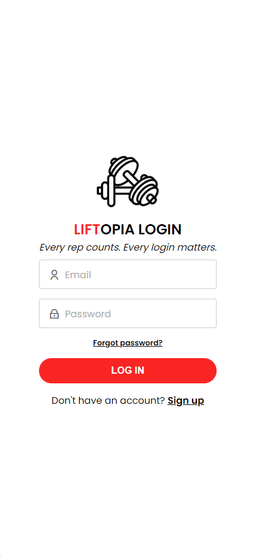
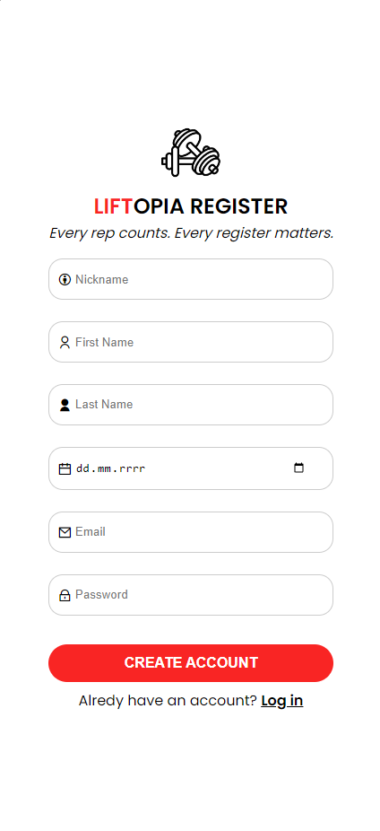
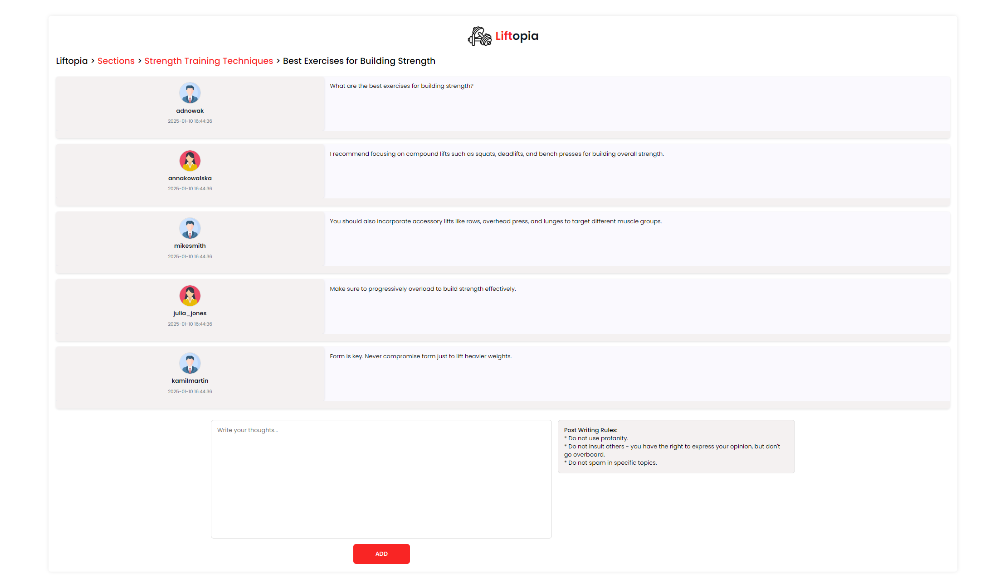
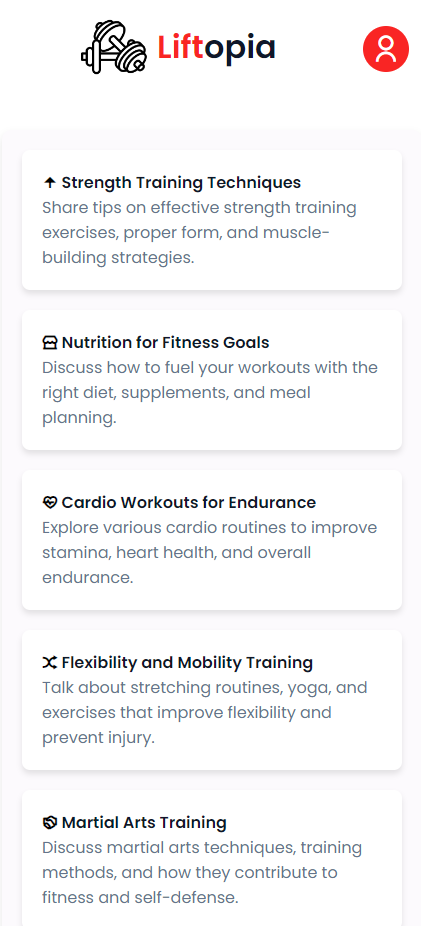
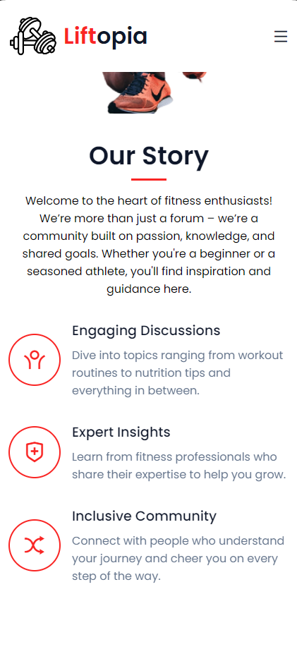
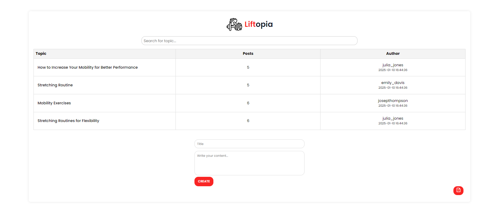

<h1>Liftopia</h1>

  Liftopia is a web application developed as part of the "Introduction to Web Application Design" course. The project aims to create a community platform for fitness enthusiasts, where users can interact, share fitness-related tips, discuss training programs, and support each other on their fitness journeys. The forum-style design enables users to post topics and reply to discussions.
  The main goal of Liftopia is to provide a space where individuals can find motivation and advice. 
  The application is offering a clean, user-friendly interface, easy navigation, and an engaging community experience. It includes features such as topic categorization, user profiles, and the ability to join discussions on specific fitness topics.

  
  
  
  
  
  

<h2>Instalation</h2>

Set up the environment for the app by using Docker. Start your Docker Desktop and make sure you are in the /Liftopia-wdpai directory, then enter the following command in your command line.

<pre><code>docker-compose up --build</code></pre>

<h4>Database credentials</h4>
<pre><code>POSTGRES_USER: postgres
POSTGRES_PASSWORD: mysecretpassword
</code></pre>

<h2>Technologies</h2>

     
     
     
     
    
  

<h2>Usage</h2>
Every user, even unlogged, has access to the following pages:

- `/` - Home Page
- `/login` - Login Page
- `/register` - Registration Page

Once a user registers, they are redirected to: `/login`.

If the user logs in successfully, they gain access to:

- `/sections` - View sections and topics
- `/profile` - Profile page where users can change their email, nickname, and profile image
